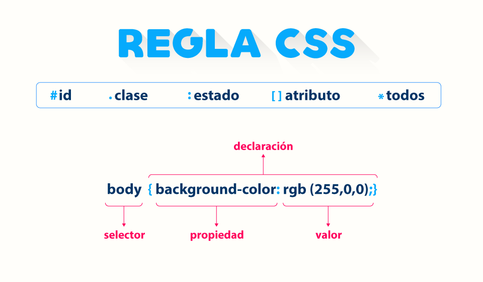

### Regla CSS ###

#### Regla ####

Una regla css se compone de uno o más selectores seguidos de una declaración que consta de una o más parejas de propiedad y valor. Un archivo css puede contener múltiples reglas.

#### Selector ####

Los selectores indican a cuáles elementos del documento HTML se debe aplicar una regla. Una regla puede contener uno o más selectores, separados por coma.

#### Propiedad ####

Las propiedades son características visuales que tienen los elementos HTML Una declaración puede contener una o más propiedades, cada una con su respectivo valor y separadas por punto y coma.

